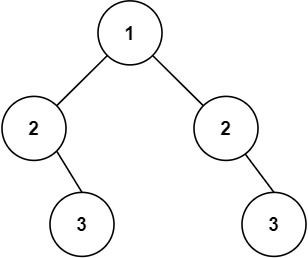

# 101. Symmetric Tree

**Link:** https://leetcode.com/problems/symmetric-tree/

**Difficulty:** Easy

---

## Problem Statement

Given the `root` of a binary tree, _check whether it is a mirror of itself_ (i.e., symmetric around its center).

## Examples

**Example 1:**

 \
**Input:** root = [1,2,2,3,4,4,3] \
**Output:** true

**Example 2:**

 \
**Input:** root = [1,2,2,null,3,null,3] \
**Output:** false

---

## Constraints:

- The number of nodes in both trees is in the range `[0, 100]`.
- `-100 <= Node.val <= 100`

---