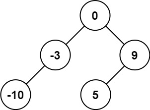
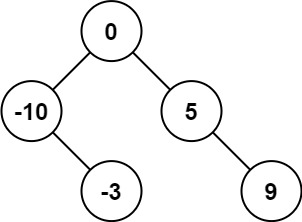
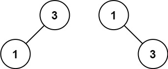

# 108. Convert Sorted Array to Binary Search Tree

**Link:** https://leetcode.com/problems/convert-sorted-array-to-binary-search-tree/

**Difficulty:** Easy

---

## Problem Statement

Given an integer array `nums` where the elements are sorted in **ascending order**, convert _it to a **height-balanced** binary search tree_.

---

## Examples

**Example 1:**

 \
**Input:** nums = [-10,-3,0,5,9] \
**Output:** [0,-3,9,-10,null,5] \
**Explanation:** [0,-10,5,null,-3,null,9] is also accepted: \

**Example 2:**

 \
**Input:** nums = [1,3] \
**Output:** [3,1] \
**Explanation:** [1,null,3] and [3,1] are both height-balanced BSTs.

---

## Constraints

- <code>1 <= nums.length <= 104</code>
- <code>-104 <= nums[i] <= 104</code>
- `nums` is sorted in a **strictly increasing** order.

---