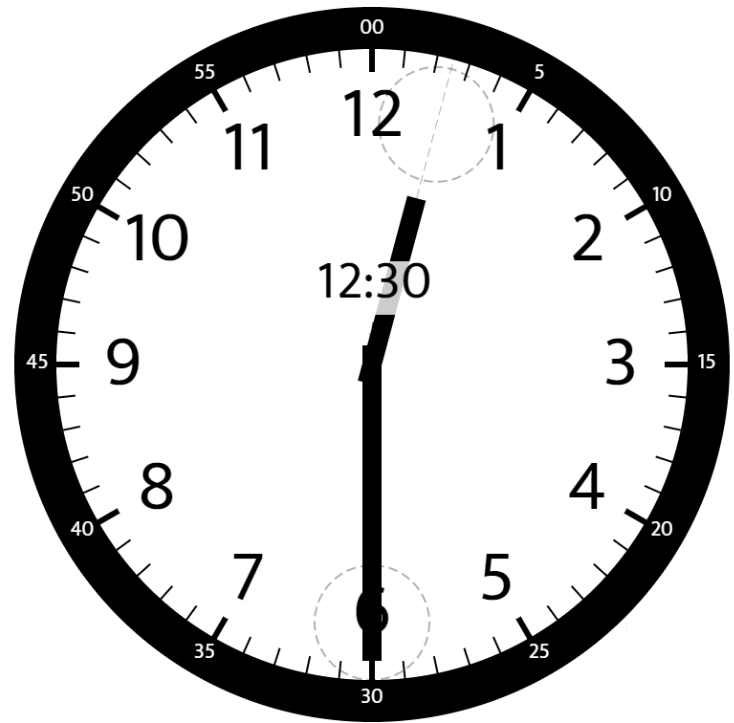
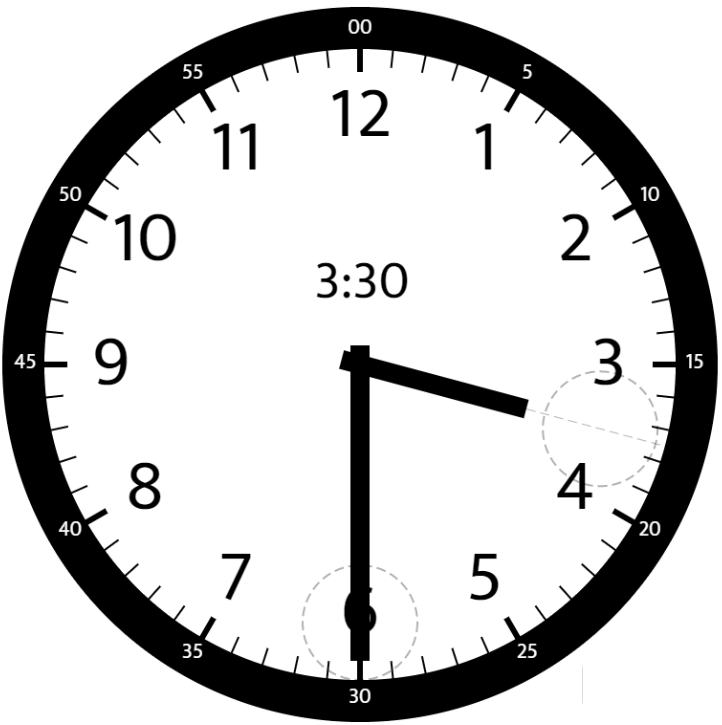
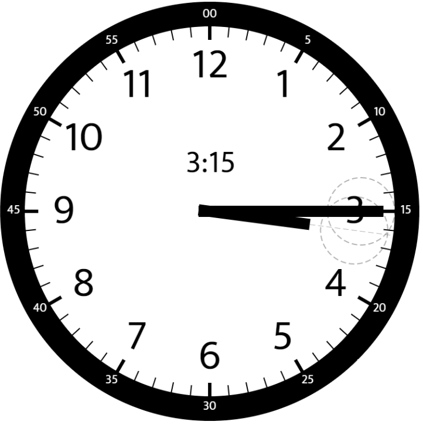

# 1344. Angle Between Hands of a Clock

**Link:** https://leetcode.com/problems/angle-between-hands-of-a-clock/

**Difficulty:** Medium

---

## Problem Statement

Given two numbers, `hour` and `minutes`, return _the smaller angle (in degrees) formed between the_ `hour` _and the_ `minute` _hand_.

Answers within <code>10-5</code> of the actual value will be accepted as correct.

## Examples

**Example 1:**

 \
**Input:** hour = 12, minutes = 30 \
**Output:** 165

**Example 2:**

 \
**Input:** hour = 3, minutes = 30 \
**Output:** 75

**Example 3:**

 \
**Input:** hour = 3, minutes = 15 \
**Output:** 7.5

---

## Constraints:

- `1 <= hour <= 12`
- `0 <= minutes <= 59`

---