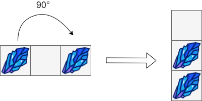
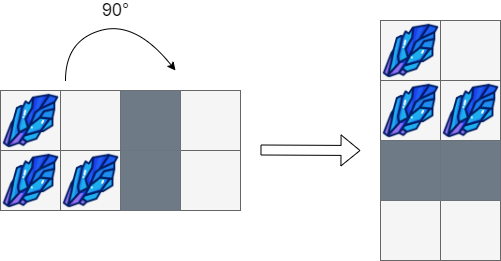
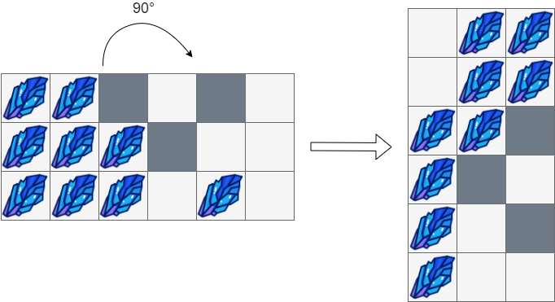

# 1861. Rotating the Box

**Link:** https://leetcode.com/problems/rotating-the-box/

**Difficulty:** Medium

---

## Problem Statement

You are given an `m x n` matrix of characters `boxGrid` representing a side-view of a box. Each cell of the box is one of the following:

- A stone `'#'`
- A stationary obstacle `'*'`
- Empty `'.'`

The box is rotated **90 degrees clockwise**, causing some of the stones to fall due to gravity. Each stone falls down until it lands on an obstacle, another stone, or the bottom of the box. Gravity **does not** affect the obstacles' positions, and the inertia from the box's rotation **does not** affect the stones' horizontal positions.

It is **guaranteed** that each stone in `boxGrid` rests on an obstacle, another stone, or the bottom of the box.

Return _an_ `n x m` _matrix representing the box after the rotation described above._

## Examples

**Example 1:**

 \
**Input:** boxGrid = [["#",".","#"]] \
**Output:** [["."], \
&nbsp;&nbsp;&nbsp;&nbsp;&nbsp;&nbsp;&nbsp;&nbsp;&nbsp;&nbsp;&nbsp;&nbsp;&nbsp;&nbsp;&nbsp;["#"], \
&nbsp;&nbsp;&nbsp;&nbsp;&nbsp;&nbsp;&nbsp;&nbsp;&nbsp;&nbsp;&nbsp;&nbsp;&nbsp;&nbsp;&nbsp;["#"]]

**Example 2:**

 \
**Input:** boxGrid = [["#",".","\*","."], \
&nbsp;&nbsp;&nbsp;&nbsp;&nbsp;&nbsp;&nbsp;&nbsp;&nbsp;&nbsp;&nbsp;&nbsp;&nbsp;&nbsp;&nbsp;&nbsp;&nbsp;&nbsp;&nbsp;&nbsp;&nbsp;&nbsp;&nbsp;&nbsp;["#","#","\*","."]] \
**Output:** [["#","."], \
&nbsp;&nbsp;&nbsp;&nbsp;&nbsp;&nbsp;&nbsp;&nbsp;&nbsp;&nbsp;&nbsp;&nbsp;&nbsp;&nbsp;&nbsp;["#","#"], \
&nbsp;&nbsp;&nbsp;&nbsp;&nbsp;&nbsp;&nbsp;&nbsp;&nbsp;&nbsp;&nbsp;&nbsp;&nbsp;&nbsp;&nbsp;["\*","\*"], \
&nbsp;&nbsp;&nbsp;&nbsp;&nbsp;&nbsp;&nbsp;&nbsp;&nbsp;&nbsp;&nbsp;&nbsp;&nbsp;&nbsp;&nbsp;[".","."]]

**Example 3:**

 \
**Input:** boxGrid = [["#","#","\*",".","\*","."], \
&nbsp;&nbsp;&nbsp;&nbsp;&nbsp;&nbsp;&nbsp;&nbsp;&nbsp;&nbsp;&nbsp;&nbsp;&nbsp;&nbsp;&nbsp;&nbsp;&nbsp;&nbsp;&nbsp;&nbsp;&nbsp;&nbsp;&nbsp;&nbsp;["#","#","#","\*",".","."], \
&nbsp;&nbsp;&nbsp;&nbsp;&nbsp;&nbsp;&nbsp;&nbsp;&nbsp;&nbsp;&nbsp;&nbsp;&nbsp;&nbsp;&nbsp;&nbsp;&nbsp;&nbsp;&nbsp;&nbsp;&nbsp;&nbsp;&nbsp;&nbsp;["#","#","#",".","#","."]] \
**Output:** [[".","#","#"], \
&nbsp;&nbsp;&nbsp;&nbsp;&nbsp;&nbsp;&nbsp;&nbsp;&nbsp;&nbsp;&nbsp;&nbsp;&nbsp;&nbsp;&nbsp;&nbsp;[".","#","#"], \
&nbsp;&nbsp;&nbsp;&nbsp;&nbsp;&nbsp;&nbsp;&nbsp;&nbsp;&nbsp;&nbsp;&nbsp;&nbsp;&nbsp;&nbsp;&nbsp;["#","#","\*"], \
&nbsp;&nbsp;&nbsp;&nbsp;&nbsp;&nbsp;&nbsp;&nbsp;&nbsp;&nbsp;&nbsp;&nbsp;&nbsp;&nbsp;&nbsp;&nbsp;["#","\*","."], \
&nbsp;&nbsp;&nbsp;&nbsp;&nbsp;&nbsp;&nbsp;&nbsp;&nbsp;&nbsp;&nbsp;&nbsp;&nbsp;&nbsp;&nbsp;&nbsp;["#",".","\*"], \
&nbsp;&nbsp;&nbsp;&nbsp;&nbsp;&nbsp;&nbsp;&nbsp;&nbsp;&nbsp;&nbsp;&nbsp;&nbsp;&nbsp;&nbsp;&nbsp;["#",".","."]]

---

## Constraints:

- `m == boxGrid.length`
- `n == boxGrid[i].length`
- `1 <= m, n <= 500`
- `boxGrid[i][j]` is either `'#'`, `'*'`, or `'.'`.

---