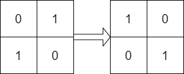
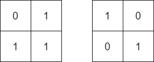
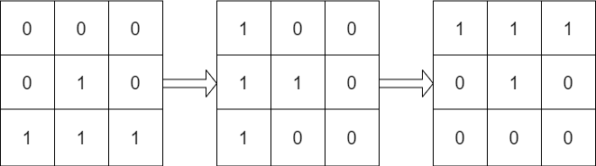

# 1886. Determine Whether Matrix Can Be Obtained By Rotation

**Link:** https://leetcode.com/problems/determine-whether-matrix-can-be-obtained-by-rotation/

**Difficulty:** Easy

---

## Problem Statement

Given two `n x n` binary matrices `mat` and `target`, return `true` _if it is possible to make_ `mat` _equal to_ `target` _by **rotating**_ `mat` _in **90-degree increments**, or_ `false` _otherwise_.

---

## Examples

**Example 1:**

 \
**Input:** mat = [[0,1],[1,0]], target = [[1,0],[0,1]] \
**Output:** true \
**Explanation:** We can rotate mat 90 degrees clockwise to make mat equal target.

**Example 2:**

 \
**Input:** mat = [[0,1],[1,1]], target = [[1,0],[0,1]] \
**Output:** false \
**Explanation:** It is impossible to make mat equal to target by rotating mat.

**Example 3:**

 \
**Input:** mat = [[0,0,0],[0,1,0],[1,1,1]], target = [[1,1,1],[0,1,0],[0,0,0]] \
**Output:** true \
**Explanation:** We can rotate mat 90 degrees clockwise two times to make mat equal target.

---

## Constraints

- `n == mat.length == target.length`
- `n == mat[i].length == target[i].length`
- `1 <= n <= 10`
- `mat[i][j]` and `target[i][j]` are either `0` or `1`.

---