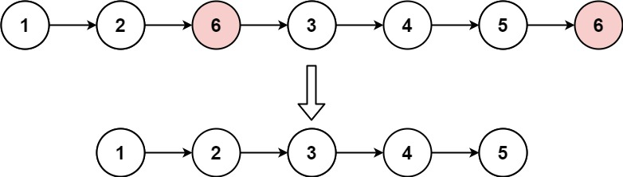

# 203. Remove Linked List Elements

**Link:** https://leetcode.com/problems/remove-linked-list-elements/

**Difficulty:** Easy

---

## Problem Statement

Given the `head` of a linked list and an integer `val`, remove all the nodes of the linked list that has `Node.val == val`, and return _the new head_.

---

## Examples

**Example 1:**

 \
**Input:** head = [1,2,6,3,4,5,6], val = 6 \
**Output:** [1,2,3,4,5]

**Example 2:**

**Input:** head = [], val = 1 \
**Output:** []

**Example 3:**

**Input:** head = [7,7,7,7], val = 7 \
**Output:** []

---

## Constraints

- The number of nodes in the list is in the range <code>[0, 104]</code>
- `1 <= Node.val <= 50`
- `0 <= val <= 50`

---