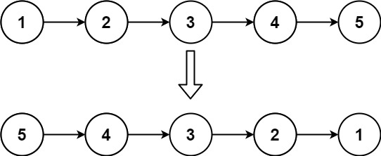
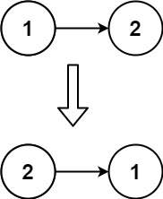

# 206. Reverse Linked List

**Link:** https://leetcode.com/problems/reverse-linked-list/

**Difficulty:** Easy

---

## Problem Statement

Given the `head` of a singly linked list, reverse the list, and return _the reversed list_.

---

## Examples

**Example 1:**

 \
**Input:** head = [1,2,3,4,5] \
**Output:** [5,4,3,2,1]

**Example 2:**

 \
**Input:** head = [1,2] \
**Output:** [2,1]

**Example 3:**

**Input:** head = [] \
**Output:** []

---

## Constraints

- The number of nodes in the list is the range `[0, 5000]`.
- `-5000 <= Node.val <= 5000`

---