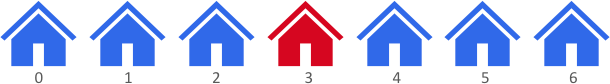
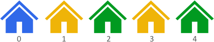

# 2078. Two Furthest Houses With Different Colors

**Link:** https://leetcode.com/problems/two-furthest-houses-with-different-colors/

**Difficulty:** Easy

---

## Problem Statement

There are `n` houses evenly lined up on the street, and each house is beautifully painted. You are given a **0-indexed** integer array `colors` of length `n`, where `colors[i]` represents the color of the <code>ith</code> house.

Return _the **maximum** distance between **two** houses with **different** colors_.

The distance between the <code>ith</code> and <code>jth</code> houses is `abs(i - j)`, where `abs(x)` is the **absolute value** of `x`.

---

## Examples

**Example 1:**

 \
**Input:** colors = [<u>**1**</u>,1,1,<u>**6**</u>,1,1,1] \
**Output:** 3 \
**Explanation:** In the above image, color 1 is blue, and color 6 is red. \
The furthest two houses with different colors are house 0 and house 3. \
House 0 has color 1, and house 3 has color 6. The distance between them is abs(0 - 3) = 3. \
Note that houses 3 and 6 can also produce the optimal answer.

**Example 2:**

 \
**Input:** colors = [<u>**1**</u>,8,3,8,<u>**3**</u>] \
**Output:** 4 \
**Explanation:** In the above image, color 1 is blue, color 8 is yellow, and color 3 is green. \
The furthest two houses with different colors are house 0 and house 4. \
House 0 has color 1, and house 4 has color 3. The distance between them is abs(0 - 4) = 4.

**Example 3:**

**Input:** colors = [<u>**0**</u>,<u>**1**</u>] \
**Output:** 1 \
**Explanation:** The furthest two houses with different colors are house 0 and house 1. \
House 0 has color 0, and house 1 has color 1. The distance between them is abs(0 - 1) = 1.

---

## Constraints

- `n == colors.length`
- `2 <= n <= 100`
- `0 <= colors[i] <= 100`
- Test data are generated such that **at least** two houses have different colors.

---