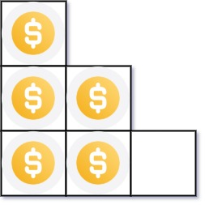
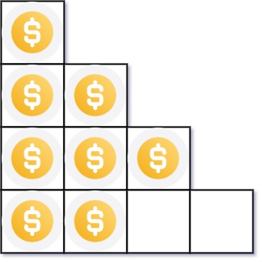

# 441. Arranging Coins

**Link:** https://leetcode.com/problems/arranging-coins/

**Difficulty:** Easy

---

## Problem Statement

You have `n` coins and you want to build a staircase with these coins. The staircase consists of `k` rows where the <code>ith</code> row has exactly `i` coins. The last row of the staircase **may be** incomplete.

Given the integer `n`, return _the number of **complete rows** of the staircase you will build_.

## Examples

**Example 1:**

 \
**Input:** n = 5 \
**Output:** 2 \
**Explanation:** Because the 3rd row is incomplete, we return 2.

**Example 2:**

 \
**Input:** n = 8 \
**Output:** 3 \
**Explanation:** Because the 4th row is incomplete, we return 3.

---

## Constraints:

- <code>1 <= n <= 231 - 1</code>

---