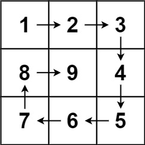

# 59. Spiral Matrix II

**Link:** https://leetcode.com/problems/spiral-matrix-ii/

**Difficulty:** Medium

---

## Problem Statement

Given a positive integer `n`, generate an `n x n` `matrix` filled with elements from `1` to <code>n2</code> in spiral order.

---

## Examples

**Example 1:**

 \
**Input:** n = 3 \
**Output:** [[1,2,3],[8,9,4],[7,6,5]]

**Example 2:**

**Input:** n = 1 \
**Output:** [[1]]

---

## Constraints

- `1 <= n <= 20`

---